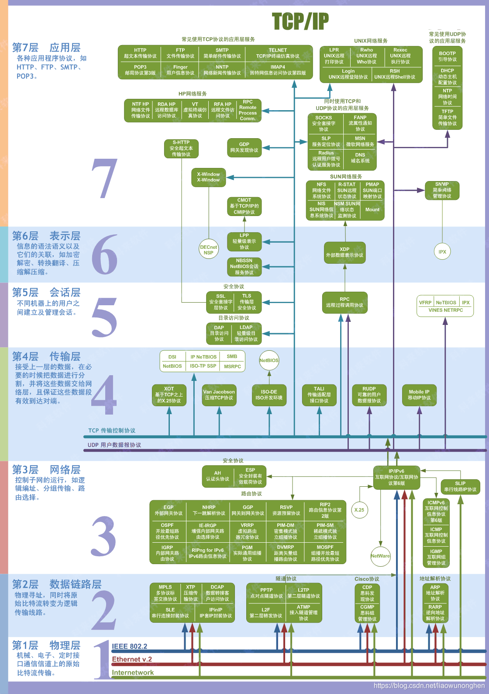
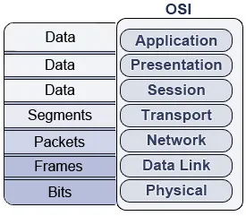
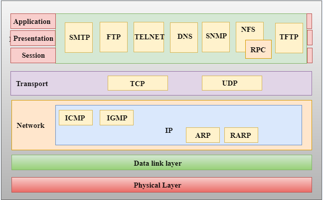
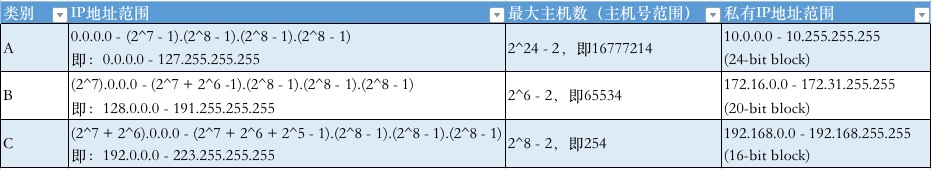
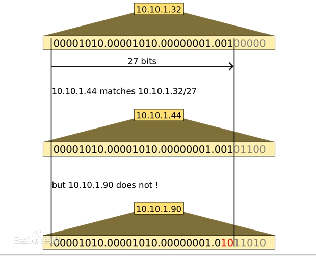
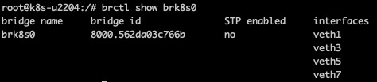
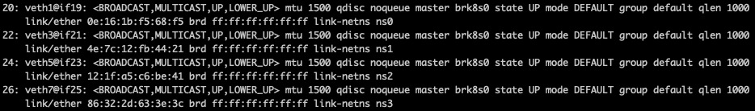
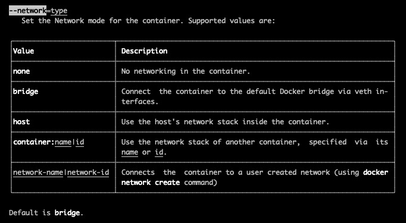
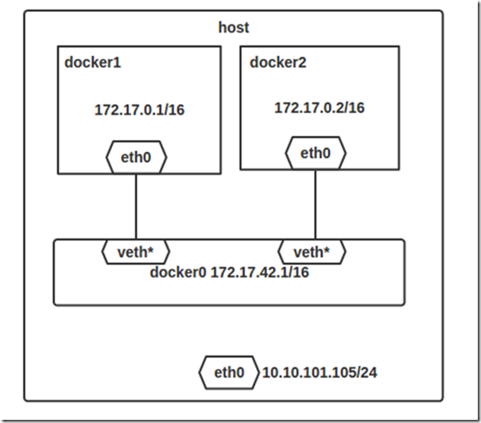
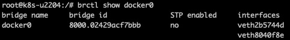

## 网络知识回顾

### OSI Model - 七层网络模型

OSI（Open Systems Interconnection）七层网络模型，**上三层称为高层**，定义应用程序之间的通信和人机界面。即上三层负责把电脑能看懂的东西转化为人能看懂的东西，或把人能看懂的东西转化为电脑能看懂的东西。**下四层称为底层**，定义的是数据如何端到端的传输，物理规范以及数据与光电信号间的转换。

**<u>P</u>**hysical 物理层（Layer 1）：机械、电子、定时接口通信信道上的原始比特流传输。

**<u>D</u>**ata Link 数据链路层（Layer 2）：物理寻址，同时将比特流转变为逻辑传输线路。

**<u>N</u>**etwork 网络层（Layer 3 ）： 控制子网的运行，如逻辑编址、分组传输、路由选择。

**<u>T</u>**ransport 传输层（Layer 4）： 接受上一层的数据，在必要的时候把数据进行分割，并将这些数据交给网络层，且保证这些数据段有效到达队端。

**<u>S</u>**ession 会话层（Layer 5）：不同机器上的用户之间建立及管理会话。

**<u>P</u>**resentation 表示层（Layer 6）： 信息的语法语义以及它们的关联，如加密解密、转换翻译、压缩解压缩。

**<u>A</u>**pplication 应用层（Layer 7）： 各种应用程序协议。

分层使得复杂的问题简单化。网络上跑的包都是完整的，层层封装的。

记忆口诀：

- 由低到高：**<u>P</u>**lease **<u>D</u>**o **<u>N</u>**ot **<u>T</u>**ell **<u>S</u>**tupied **<u>P</u>**eople **<u>A</u>**nything.
- 由高到低：**<u>A</u>**ll People **<u>S</u>**eem **<u>T</u>**o **<u>N</u>**eed **<u>D</u>**ata **<u>P</u>**rocessing.

#### **数据在不同层的不同叫法**

###TCP/IP Model - 五层网络模型

### 

### 网络协议与设备

#### IPv4的地址划分

IP协议里重要的概念：IP地址（Internet Protocol Address），即指互联网协议地址。IP地址是一个网卡在网络世界的通讯地址。相当于我们购物时所填写的详细地址。IPv4共32个bits，每8bits为一个部分。

 

- 网络地址（全0）和广播地址（全1）不可分配。
- 如何区分某IP属于哪种类型的地址？第一个字节，从头到尾一位一位的捋。
- 这里应当有个题目，给定网络地址，来计算合法的主机地址。

#### 无类型域间选路（CIDR）

CIDR（无类型域间选路，Classless Inter-Domain Routing）是一个在Internet上创建附加地址的方法，这些地址提供给服务提供商（ISP），再由ISP分配给客户。CIDR将路由集中起来， 使一个IP地址代表主要骨干提供商服务的几千个IP地址，从而减轻路由器的负担。伴随着CIDR存在的，一个是广播地址，另一个是子网掩码。

IP地址网段常用网络掩码表示，也就是“/”后面的数字（比如“/27”），因为IPv4是32位，所以前面的位数就是网络号，后面的位数就是主机号，网络号不同就不处于一个网络段。

#### MAC地址

Media Access Control Address，直译为媒体存取控制位址，也称为**局域网地址（LAN Address）**，MAC地址，以太网地址（Ethernet Address）或物理地址（Physical Address），**它是一个用来确认网络设备位置的位址**。是每台设备的唯一网络标识。**相当于我们的身份证号。**

MAC 地址是一个局域网内才有效的地址。因而，MAC 地址只要过网关，就必定会改变，因为已经换了局域网。

#### 常见网络设备

**网桥（Bridge）**：是早期的两端口**二层网络设备**。网桥是**一种对帧进行转发的技术**，根据MAC分区块，可隔离碰撞。网桥将网络的同一网段在**数据链路层**连接起来，只能连接同构网络(同一网段)，不能连接异构网络（不同网段）。后来，网桥被具有更多端口、同时也可隔离冲突域的**交换机（Switch）**所取代。

**网关（Gateway）**：又称网间连接器、协议转换器。网关的结构也和路由器类似，不同的是互连层。网关既可以用于广域网互连，也可以用于局域网互连。**通俗讲，网关是一个概念，并不具体指某一个设备**，只要能够实现以上功能的设备，都称为网关，网关可以是路由器，交换机，甚至是电脑。

不改变 IP 地址的网关，我们称为转发网关；改变 IP 地址的网关，我们称为NAT 网关。

**路由器（Router）**：路由器又可以称之为网关设备。通常位于网络层，因而路由技术也是与网络层相关的一门技术。

**veth-pair** ([veth](https://man7.org/linux/man-pages/man4/veth.4.html) - Virtual Ethernet Device) ：是一种成对出现的虚拟网络设备，它一端连接网络协议栈，一端彼此相连。在容器的网络方案中基本都能看到veth pair的身影，它的跨网络命名空间联通性很好的匹配了容器网络需求。

## 容器网络中的隔离技术

容器主要使用了两种隔离技术，一种是**看起来是隔离的技术**，称为namespace，即每个namespace下看到的是不同的IP地址、进程号等。另一种是**用起来是隔离的技术**，称为cgroup，即整台主机有很多的CPU、内存，而一个应用只能用其中的一部分。

### namespace

[Linux 内核](https://github.com/torvalds/linux/blob/master/include/linux/nsproxy.h#L31)包含了不同类型的 namespace。每个 namespace 都有自己的独特属性。

- [user namespace](https://link.zhihu.com/?target=https%3A//man7.org/linux/man-pages/man7/user_namespaces.7.html) 拥有自己的一组用户 ID 和组 ID，用于分配给进程。这意味着进程可以在其 user namespace 中拥有 `root 权限，而不需要在其他 user namespace 中获得。`
- [process ID (PID) namespace](https://link.zhihu.com/?target=https%3A//man7.org/linux/man-pages/man7/pid_namespaces.7.html) 将一组 PID 分配给独立于其他 namespace 中的一组 PID 的进程。在新的 namespace 中创建的第一个进程分得 PID 1，子进程被分配给后续的 PID。如果子进程使用自己的 PID namespace 创建，则它在该 namespace 中使用 PID 1，在父进程的 namespace 中使用自己的 PID。
- [network namespace](https://link.zhihu.com/?target=https%3A//man7.org/linux/man-pages/man7/network_namespaces.7.html) 拥有独立的网络栈：自己的专用路由表、IP 地址集、套接字列表、连接跟踪表、防火墙及其他网络相关资源。
- [mount namespace](https://link.zhihu.com/?target=https%3A//man7.org/linux/man-pages/man7/mount_namespaces.7.html) 拥有一个独立的挂载点列表，并对该 namespace 中的进程可见。这意味着您可以在 mount namespace 中挂载和卸载文件系统，而不会影响主机文件系统。
- [interprocess communication (IPC) namespace](https://link.zhihu.com/?target=https%3A//man7.org/linux/man-pages/man7/ipc_namespaces.7.html) 拥有自己的 IPC 资源，例如 [POSIX 消息队列](https://link.zhihu.com/?target=https%3A//man7.org/linux/man-pages/man7/mq_overview.7.html)。
- [UNIX Time‑Sharing (UTS) namespace](https://link.zhihu.com/?target=https%3A//man7.org/linux/man-pages/man7/uts_namespaces.7.html) 允许单个系统对不同的进程显示不同的主机名和域名。

namespace 的主要作用：封装抽象，限制，隔离，使命名空间内的进程看起来拥有他们自己的全局资源。

**network namespace** 是实现网络虚拟化的重要功能，它能创建多个隔离的网络空间，它们有独自的网络栈信息。不管是虚拟机还是容器，运行的时候仿佛自己就在独立的网络中。

#### 创建自己的 network namespace

> root@k8s-u2204:/# ip netns add nsk8s0
> Cannot create namespace file "/run/netns/nsk8s0": File exists
> root@k8s-u2204:/# ip netns
> nsk8s0

`ip netns`创建的命令net ns会出现在`/var/run/netns/`目录下。

有了自己创建的 network namespace，我们还需要看看它里面有哪些东西。对于每个 network namespace 来说，它会有自己独立的网卡、路由表、ARP 表、iptables 等和网络相关的资源。`ip`命令提供了 `ip netns exec` 子命令可以在对应的 network namespace 中执行命令。要执行的可以是任何命令，不只是和网络相关的**（当然，和网络无关命令执行的结果和在外部执行没有区别）。比如下面例子中，执行 `bash` 命令了之后，后面所有的命令都是在这个 network namespace 中执行的，好处是不用每次执行命令都要把 `ip netns exec NAME` 补全，缺点是你无法清楚知道自己当前所在的 `shell`，容易混淆。

>root@k8s-u2204:/# ip netns exec nsk8s0 ip addr
>1: lo: <LOOPBACK> mtu 65536 qdisc noop state DOWN group default qlen 1000
>	link/loopback 00:00:00:00:00:00 brd 00:00:00:00:00:00
>
>root@k8s-u2204:/# ip netns exec nsk8s0 bash
>**root@k8s-u2204:/# ip addr**
>1: lo: <LOOPBACK> mtu 65536 qdisc noop state DOWN group default qlen 1000
>	link/loopback 00:00:00:00:00:00 brd 00:00:00:00:00:00

每个 namespace 在创建的时候会自动创建一个 `lo` 的 interface，它的作用和 linux 系统中默认看到的 `lo` 一样，都是为了实现 loopback 通信。如果希望 `lo` 能工作，记得启用它：

>root@k8s-u2204:/# ip netns exec nsk8s0 ip link set lo up
>root@k8s-u2204:/# ip netns exec nsk8s0 ip addr
>1: lo: <LOOPBACK,UP,LOWER_UP> mtu 65536 qdisc noqueue state UNKNOWN group default qlen 1000
>    link/loopback 00:00:00:00:00:00 brd 00:00:00:00:00:00
>    inet 127.0.0.1/8 scope host lo
>        valid_lft forever preferred_lft forever
>    inet6 ::1/128 scope host
>        valid_lft forever preferred_lft forever

#### 使用veth pair连通两个netns

默认情况下，network namespace 是不能和主机网络，或者其他 network namespace 通信的。

有了不同 network namespace 之后，也就有了网络的隔离，但是如果它们之间没有办法通信，也没有实际用处。要把两个网络连接起来，就需要linux 提供的 `veth pair` 登场了。可以把 `veth pair` 当做是双向的 pipe（管道），从一个方向发送的网络数据，可以直接被另外一端接收到；或者也可以想象成两个 namespace 直接通过一个特殊的虚拟网卡连接起来，可以直接通信。

> ip link add type veth
>
> **16: veth0@veth1**: <BROADCAST,MULTICAST,M-DOWN> mtu 1500 qdisc noop state DOWN mode DEFAULT group default qlen 1000
>        link/ether 7e:93:8b:13:72:b3 brd ff:ff:ff:ff:ff:ff
> **17: veth1@veth0**: <BROADCAST,MULTICAST,M-DOWN> mtu 1500 qdisc noop state DOWN mode DEFAULT group default qlen 1000
>        link/ether 0e:16:1b:f5:68:f5 brd ff:ff:ff:ff:ff:ff

接下来，要做的是把这对 veth pair 分别放到已经两个 namespace 里面，这个可以使用 `ip link set DEVICE netns NAME` 来实现：

把veth pair分别放到对应的netns里：

>root@k8s-u2204:/# ip link set **veth0** netns **nsk8s0**
>root@k8s-u2204:/# **ip netns exec nsk8s0 ip l**
>1: lo: <LOOPBACK,UP,LOWER_UP> mtu 65536 qdisc noqueue state UNKNOWN mode DEFAULT group default qlen 1000
>    link/loopback 00:00:00:00:00:00 brd 00:00:00:00:00:00
>**16: veth0@if17**: <BROADCAST,MULTICAST> mtu 1500 qdisc noop state DOWN mode DEFAULT group default qlen 1000
>    link/ether 7e:93:8b:13:72:b3 brd ff:ff:ff:ff:ff:ff link-netns nsk8s1

>root@k8s-u2204:/# ip link set **veth1** netns **nsk8s1**
>root@k8s-u2204:/# **ip netns exec nsk8s1 ip l**
>1: lo: <LOOPBACK,UP,LOWER_UP> mtu 65536 qdisc noqueue state UNKNOWN mode DEFAULT group default qlen 1000
>    link/loopback 00:00:00:00:00:00 brd 00:00:00:00:00:00
>**17: veth1@if16**: <BROADCAST,MULTICAST> mtu 1500 qdisc noop state DOWN mode DEFAULT group default qlen 1000
>    link/ether 0e:16:1b:f5:68:f5 brd ff:ff:ff:ff:ff:ff link-netns nsk8s0

启用veth pair并配上地址：

>root@k8s-u2204:/# ip netns exec nsk8s0 ip link set veth0 up
>root@k8s-u2204:/# ip netns exec nsk8s1 ip link set veth1 up

> root@k8s-u2204:/# ip netns exec nsk8s0 ip addr add 10.0.0.1/24 dev veth0
>
> root@k8s-u2204:/# ip netns exec nsk8s1 ip addr add 10.0.0.2/24 dev veth1

可以ping得通：

>root@k8s-u2204:/# ip netns exec nsk8s0 ping -c 3  10.0.0.2
>PING 10.0.0.2 (10.0.0.2) 56(84) bytes of data.
>64 bytes from 10.0.0.2: icmp_seq=1 ttl=64 time=0.041 ms
>64 bytes from 10.0.0.2: icmp_seq=2 ttl=64 time=0.041 ms
>64 bytes from 10.0.0.2: icmp_seq=3 ttl=64 time=0.057 ms
>
>--- 10.0.0.2 ping statistics ---
>3 packets transmitted, 3 received, 0% packet loss, time 2026ms
>rtt min/avg/max/mdev = 0.041/0.046/0.057/0.007 ms

#### 使用bridge连通两个netns

当有多个netns需要通讯的时候，点多点的veth pair就力不从心了。多个网络设备通信，我们首先想到的是交换机和路由器。这里考虑的是同个网络，所以只用到交换机的功能。

创建一个bridge

> root@k8s-u2204:/# ip link add brk8s0 type bridge
>
> root@k8s-u2204:/# ip link set dev brk8s0 up
>
> root@k8s-u2204:/# ip l
> **18: brk8s0**: <NO-CARRIER,BROADCAST,MULTICAST,UP> mtu 1500 qdisc noqueue state DOWN mode DEFAULT group default qlen 1000
>     link/ether 56:2d:a0:3c:76:6b brd ff:ff:ff:ff:ff:ff

创建四个netns

> root@k8s-u2204:/# ip netns add ns0
> root@k8s-u2204:/# ip netns add ns1
> root@k8s-u2204:/# ip netns add ns2
> root@k8s-u2204:/# ip netns add ns3

创建四个veth pair，把其中一端放入相应的netns，设置ip并启用它；另一端连上bridge(下面相似的代码要执行四遍)

> root@k8s-u2204:/# ip link add type veth
> root@k8s-u2204:/# ip link set **veth0** netns **ns0**
> root@k8s-u2204:/# ip netns exec ns0 ip addr add 10.0.1.1/24 dev veth0
> root@k8s-u2204:/# ip netns exec ns0 ip l set veth0 up
>
> root@k8s-u2204:/# ip link set dev veth1 master brk8s0

测试网络连通性

>root@k8s-u2204:/# ip netns exec ns0 ping -c 1 10.0.1.2
>PING 10.0.1.2 (10.0.1.2) 56(84) bytes of data.
>64 bytes from 10.0.1.2: icmp_seq=1 ttl=64 time=0.103 ms
>
>--- 10.0.1.2 ping statistics ---
>1 packets transmitted, 1 received, 0% packet loss, time 0ms
>rtt min/avg/max/mdev = 0.103/0.103/0.103/0.000 ms

查看bridge管理的link信息

>root@k8s-u2204:/# bridge l
>20: veth1@if19: <BROADCAST,MULTICAST,UP,LOWER_UP> mtu 1500 master brk8s0 state forwarding priority 32 cost 2
>22: veth3@if21: <BROADCAST,MULTICAST,UP,LOWER_UP> mtu 1500 master brk8s0 state forwarding priority 32 cost 2
>24: veth5@if23: <BROADCAST,MULTICAST,UP,LOWER_UP> mtu 1500 master brk8s0 state forwarding priority 32 cost 2
>26: veth7@if25: <BROADCAST,MULTICAST,UP,LOWER_UP> mtu 1500 master brk8s0 state forwarding priority 32 cost 2

#### 如何确定veth pair的哪一端在哪个netns？

到现在为止，我们已经手动建了很多veth pair了，当使用ip link查看网卡信息时，可以看到网卡最前边有个编号，这个编号就是网卡的唯一索引。网卡名称veth1@if19，可以看到veth1在bridge brk8s0里； if19表示的就是对端的索引号为19，link-ns ns0表示19号对端在ns0里。

### cgroup

cgroup的全称是control groups，是Linux内核提供的一种可以限制、隔离进程使用资源的机制。

cgroup 的主要作用：管理资源的分配、限制。

cgroup 子系统 net_cls (network classifier cgroup)是用来控制进程使用网络资源的，它并不直接控制网络读写，而是给网络包打上一个标记，具体的网络包控制由tc(traffic control)机制来处理。

## docker网络模型

#### none

> root@k8s-u2204:/# docker run -d --net=none --name=red_srv_none redis
>
> root@k8s-u2204:/# docker inspect --format '{{.HostConfig.NetworkMode}}' red_srv_none
> **none**

这种模式下，docker容器拥有自己的netns，但只有lo。这种类型的网络没办法联网，封闭的网络能很好的保证容器的安全性。

>root@k8s-u2204:/# nsenter -t $(docker inspect --format '{{.State.Pid}}' red_srv_none) --net ip a
>1: lo: <LOOPBACK,UP,LOWER_UP> mtu 65536 qdisc noqueue state UNKNOWN group default qlen 1000
>	link/loopback 00:00:00:00:00:00 brd 00:00:00:00:00:00
>	inet 127.0.0.1/8 scope host lo
> 	valid_lft forever preferred_lft forever

#### host

与宿主机共享netns。

> root@k8s-u2204:/# docker run -d --net=host --name=red_srv_host redis
>
> root@k8s-u2204:/# docker inspect --format '{{.HostConfig.NetworkMode}}' red_srv_host
> **host**

拥有宿主机的名字。

>root@**k8s-u2204**:/# docker inspect --format '{{.Config.Hostname}}' red_srv_host
**k8s-u2204**

dedault命名空间。

>root@k8s-u2204:/# docker inspect --format '{{.NetworkSettings.SandboxKey}}' red_srv_host
>/var/run/docker/netns/**default**

#### container:name|id

与另一个运行的容器共享netns。

> root@k8s-u2204:/# docker run -d --net=**container:9613b25d088e** --name=red_srv_container redis
>
> root@k8s-u2204:/# docker inspect --format '{{.HostConfig.NetworkMode}}' red_srv_container
> **container:9613b25d088e**34c3d7cbafdf1741711223a39b1da4c0f30ff909dadc9b040bfb

下面这条命令返回空，意味着没有自己的netns。

> root@k8s-u2204:/# docker inspect --format '{{.NetworkSettings.SandboxKey}}' red_srv_container

#### bridge

bridge模式时docker默认的网络设置，此模式会为每一个容器分配netwrok namespace、设置IP等，并将容器连接到虚拟网桥上。

当docker server启动时，会在主机上创建一个名为docker0的虚拟网桥，此主机上启动的docker容器会连接到这个虚拟网桥上。可以通过brctl show查看docker0网桥中的设备。

>42: **veth2b5744d**@if41: <BROADCAST,MULTICAST,UP,LOWER_UP> mtu 1500 qdisc noqueue **master docker0** state UP mode DEFAULT group default
>link/ether 82:c7::55:37:99 brd ff:ff:ff:ff:ff:ff **link-netnsid 7**

>root@k8s-u2204:/# nsenter -t $(docker inspect --format '{{.State.Pid}}' red_srv) --net ip link show type veth
>41: eth0@if42: <BROADCAST,MULTICAST,UP,LOWER_UP> mtu 1500 qdisc noqueue state UP mode DEFAULT group default
>	link/ether 02:42:ac:11:00:03 brd ff:ff:ff:ff:ff:ff link-netnsid 0

**如何找到哪个容器连到了docker0上哪个veth？**https://github.com/micahculpepper/dockerveth

>root@k8s-u2204:/# cat /sys/class/net/veth2b5744d/iflink
>**41**
>root@k8s-u2204:/# cat /sys/class/net/veth2b5744d/ifindex
>**42**
>
>container=**red_srv**; 
>container_veth=\$(nsenter -t \$(docker inspect --format '{{.State.Pid}}' \$container) --net ip link show type veth)
>container_veth_ifindex=\${container_veth%%:\*}
>grep $container_veth_ifindex /sys/class/net/veth*/iflink
>
>/sys/class/net/**veth2b5744d**/iflink:41

**docker容器network namespace怎么看？**默认netns在/var/run/netns目录下，ip netns命令默认也是读取的该目录下的入口文件。docker重新指定了该目录为/var/run/docker/netns。所以如果想使用默认的ip netns命令管理doker的netns，只需在默认目录下建指向docker netns的软连接就好了。

> root@k8s-u2204:/# for container in \$(docker ps  | awk '{print \$NF}' | grep -v NAMES); do ln -s \$(docker inspect \$container | grep SandboxKey | awk -F '"' '{if(\$4!= "") print \$4}') /var/run/netns/$container; done

>root@k8s-u2204:/# ip netns
>**interesting_greider (id: 6)**
>**red_srv (id: 7)**

建完软连接之后，再次执行`ip link `，看有什么变化。

>30: vethdf1d3fb@if29: <BROADCAST,MULTICAST,UP,LOWER_UP> mtu 1500 qdisc noqueue master docker0 state UP mode DEFAULT group default
>link/ether 66:32:a8:ed:3a:70 brd ff:ff:ff:ff:ff:ff **link-netns interesting_greider**
>42: veth2b5744d@if41: <BROADCAST,MULTICAST,UP,LOWER_UP> mtu 1500 qdisc noqueue master docker0 state UP mode DEFAULT group default
>link/ether 82:c7:51:55:37:99 brd ff:ff:ff:ff:ff:ff **link-netns red_srv**

## k8s网络模型 [TBD]

Kubernetes网络模型“IP-per-pod”能够很好地适应集群系统的网络需求，它有下面4点基本假设：

- 集群里每个pod都会有唯一的一个IP地址
- Pod里的所有容器共享这个IP地址
- 集群里的所有Pod都属于同一个网段
- Pod可以基于IP地址直接访问另一个Pod，不需要做麻烦的网络地址转换（NAT）

### Service

#### 为什么要有 Service？

在 Kubernetes 集群里 Pod 的生命周期是比较“短暂”的，虽然 Deployment 和 DaemonSet 可以维持 Pod 总体数量的稳定，但在运行过程中，难免会有 Pod 销毁又重建，这就会导致 Pod 集合处于动态的变化之中。这种“动态稳定”对于现在流行的微服务架构来说是非常致命的，试想一下，后台 Pod 的 IP 地址老是变来变去，客户端该怎么访问呢？如果不处理好这个问题，Deployment 和 DaemonSet 把 Pod 管理得再完善也是没有价值的。其实，这个问题也并不是什么难事，业内早就有解决方案来针对这样“不稳定”的后端服务，那就是“负载均衡”，典型的应用有 LVS、Nginx 等等。它们在前端与后端之间加入了一个“中间层”，屏蔽后端的变化，为前端提供一个稳定的服务。但 LVS、Nginx 毕竟不是云原生技术，所以 Kubernetes 就按照这个思路，定义了新的 API 对象：Service。

### Ingress

#### 为什么要有Ingress？

### 什么是CNI?

针对上面模型，Kubernetes专门制定了一个标准[CNI](https://github.com/containernetworking/cni/blob/main/SPEC.md)（Container Network Interface）。CNI 为网络插件定义了一系列通用接口，开发者只要遵循这个规范就可以接入 Kubernetes，为 Pod 创建虚拟网卡、分配 IP 地址、设置路由规则，最后就能够实现“IP-per-pod”网络模型。

依据实现技术的不同，CNI 插件可以大致上分成“Overlay”“Route”和“Underlay”三种。

Overlay 的原意是“覆盖”，是指它构建了一个工作在真实底层网络之上的“逻辑网络”，把原始的 Pod 网络数据封包，再通过下层网络发送出去，到了目的地再拆包。因为这个特点，它对底层网络的要求低，适应性强，缺点就是有额外的传输成本，性能较低。

Route 也是在底层网络之上工作，但它没有封包和拆包，而是使用系统内置的路由功能来实现 Pod 跨主机通信。它的好处是性能高，不过对底层网络的依赖性比较强，如果底层不支持就没办法工作了。

Underlay 就是直接用底层网络来实现 CNI，也就是说 Pod 和宿主机都在一个网络里，Pod 和宿主机是平等的。它对底层的硬件和网络的依赖性是最强的，因而不够灵活，但性能最高。

### 开源网络组件

[Flannel](https://github.com/flannel-io/flannel/)由 CoreOS 公司（已被 Redhat 收购）开发，最早是一种 Overlay 模式的网络插件，使用 UDP 和 VXLAN 技术，后来又用 Host-Gateway 技术支持了 Route 模式。Flannel 简单易用，是 Kubernetes 里最流行的 CNI 插件，但它在性能方面表现不是太好，所以一般不建议在生产环境里使用。现在还有两个常用 CNI 插件：Calico、Cilium，我们做个简略的介绍。

[Calico](https://github.com/projectcalico/calico)是一种 Route 模式的网络插件，使用 BGP 协议（Border Gateway Protocol）来维护路由信息，性能要比 Flannel 好，而且支持多种网络策略，具备数据加密、安全隔离、流量整形等功能。

仔细观察这些CNI插件会发现一个很有意思的现象，它们的名字都和纺织品有关，比如Flannel是“法兰绒”，Calico是“印花布”，Cilium是“纤毛”，大概是因为现实世界里的纺织品也是“网”，这样的命名更贴切。

[Cilium](https://github.com/cilium/cilium)是一个比较新的网络插件，同时支持 Overlay 模式和 Route 模式，它的特点是深度使用了 Linux eBPF 技术，在内核层次操作网络数据，所以性能很高，可以灵活实现各种功能。在 2021 年它加入了 CNCF，成为了孵化项目，是非常有前途的 CNI 插件。

### CNI插件是怎么工作的?

